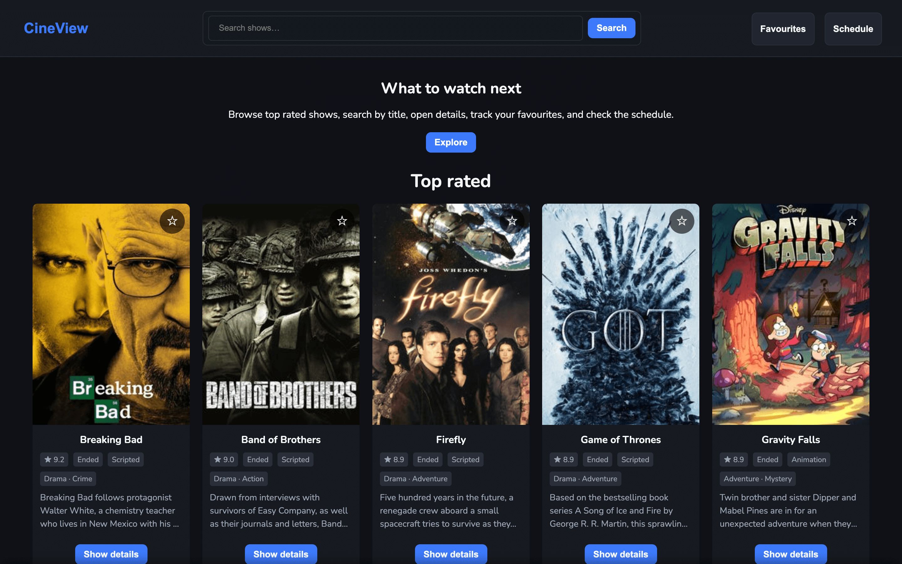
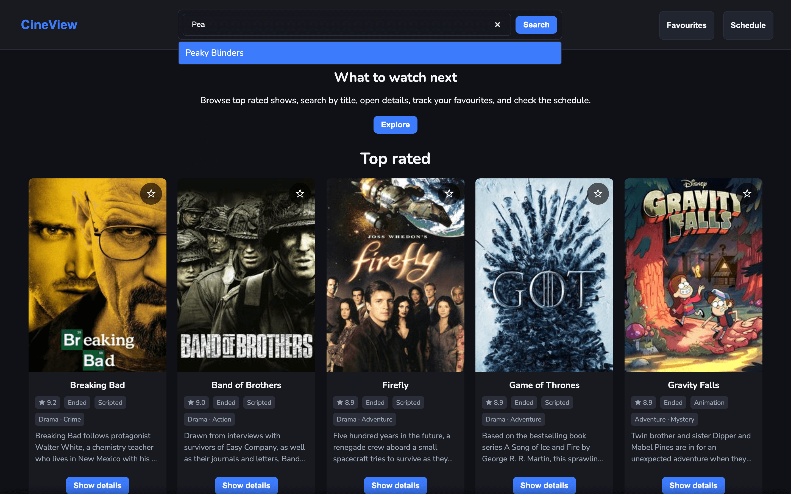
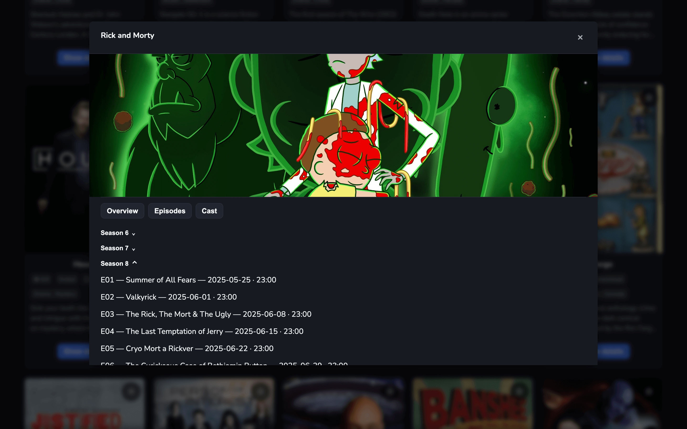
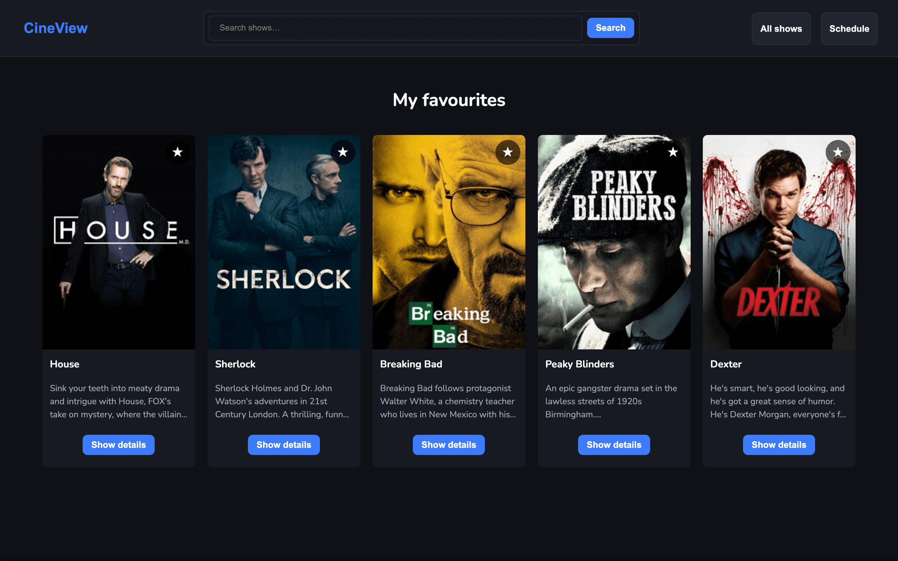
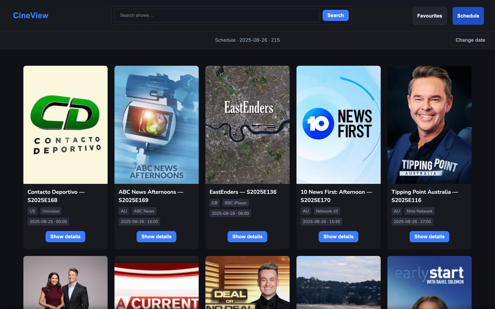
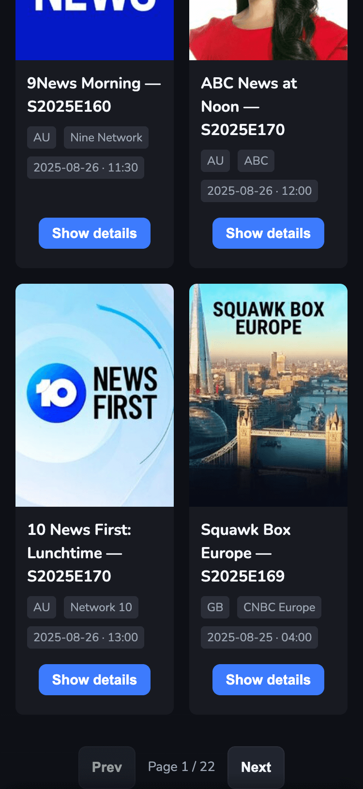

# CineView (Vanilla JS)

<p align="center">
  <a href="https://blaszczakdev.github.io/cine-view/">
    
  </a>
  &nbsp;
  
  &nbsp;
  
  &nbsp;
  
</p>

**CineView** is a small, responsive TV show browser built with **plain HTML/CSS/JS**.  
It showcases accessible UI patterns (search suggestions, modal with focus trap, keyboard support), favourites persisted in `localStorage`, and a multi‑country schedule view.

---

## ✨ Features

- 🔎 **Search with suggestions** (quick matches from a top‑rated pool)
- 🪟 **Details modal** with tabs (Overview / Episodes / Cast)
- ⭐ **Favourites** persisted in `localStorage`
- 📅 **Schedule by date** aggregated across multiple countries
- ⏭️ **Pagination** (mobile: Prev/Next; desktop: First/Prev/Page/Next/Last)
- 🧱 **Skeleton loading** + 5‑minute client cache
- ♿ **Accessible interactions**: focus trap, `Escape` to close, `inert` on background, ARIA roles/labels, `aria-pressed` on favourite
- 🖼️ Image placeholder + alt text when artwork is missing

---

## 📸 Screenshots

<p align="center">
  
</p>
<p align="center">
  
</p>
<p align="center">
  
</p>
<p align="center">
  
</p>
<p align="center">
  
</p>
<p align="center">
  
</p>

---

## 🧱 Tech Stack & Decisions

- **HTML/CSS/JS only** — no frameworks or bundlers, to highlight fundamentals
- **Mobile‑first CSS** split by breakpoints:
  - `css/main.css` (base, mobile)
  - `css/tablet.css` (≥600px)
  - `css/laptop.css` (≥1024px)
  - `css/desktop.css` (≥1440px)
- **Fetch layer** (`src/request.js`):
  - Simple in‑memory cache (TTL: 5 min)
  - Request timeout via `AbortController` (10s)
- **UI logic** (`src/app.js`):
  - Single `TvApp` class manages state & DOM updates
  - Favourite star stays in sync across cards
  - Date preference stored in `localStorage`
  - Smooth scroll to grid top on page change
- **A11y**:
  - Role/ARIA for listbox suggestions
  - `inert` on background while modal open
  - Focus trap; `Escape` closes modal

---

## 📂 Project structure

.
├─ css/  
│ ├─ main.css  
│ ├─ tablet.css  
│ ├─ laptop.css  
│ └─ desktop.css  
├─ src/  
│ ├─ app.js  
│ ├─ domInteractions.js  
│ └─ request.js  
├─ readme-media/  
│ ├─ home-top-rated-desktop.png  
│ ├─ search-suggestions.png  
│ ├─ details-modal-episodes.png  
│ ├─ favourites-grid.png  
│ ├─ schedule-bar.png  
│ └─ mobile-grid.png  
├─ .editorconfig  
├─ .gitignore  
├─ index.html  
├─ LICENSE  
└─ README.md

---

## 🚀 Run locally (no build step)

- **Option A (VS Code):** right‑click `index.html` → _Open with Live Server_
- **Option B (Python):**

```
cd cine-view
python3 -m http.server 5500
```

Then open `http://localhost:5500`

- **Option C (Node, optional):**

```
npx serve .
```

> TVMaze API is public (no API key required).

---

## ⚙️ Usage notes

- Schedule countries are predefined: US, GB, CA, AU, DE, FR, ES, IT, NL, SE, DK, NO, PL, JP, KR, BR, MX.
- The **Top rated** list comes from the first two pages of TVMaze’s shows and is sorted by rating.

---

## 🗺️ Roadmap / Future work

- URL routing (History API) to reflect state
- Basic service worker for assets & API caching
- E2E tests (Playwright) for searches, modal, favourites
- Smarter schedule aggregation (timezone/channel grouping, filters)
- Extract reusable components (card, pagination) or try a tiny lit‑based variant

---

## 📄 License

MIT
